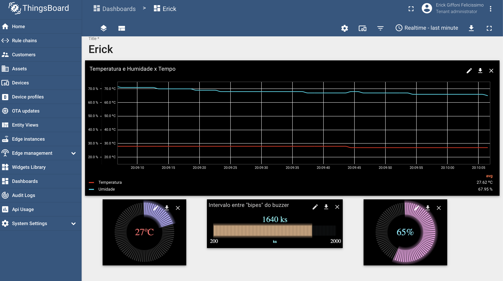

# Monitoramento de temperatura e umidade do ar com ESP32

**--> Vídeo de apresentação**: https://youtu.be/rogQOc_Kt0Q

Este trabalho utiliza o sensor DHT11 para aferir a temperatura ambiente
em ºC e a umidade relativa do ar em %. Além disso, um buzzer é utilizado
como forma de "alerta" para os valores de temperatura.

O buzzer faz curtos "bipes" para indicar o quão alta ou baixa está a
temperatura. O intervalo entre um "bipe" e outro é medido em ks (kilo
segundo), sendo que quanto mais quente estiver o ambiente, menor será
o intervalo. A tabela abaixo mostra os intervalos trabalhados dada a
temperatura medida.

| Temperatura medida (t) |                                               Intervalo entre "bipes"                                              |  Corresponde a |
|:----------------------:|:------------------------------------------------------------------------------------------------------------------:|:--------------:|
| t >= 75ºC              | 200                                                                                                                | 0.2 segundo(s) |
| 15ºC < t < 75ºC        | 2000 - ( ( (temperatura / 5) - 3 ) * 150 )                                                                         | y segundo(s)   |
| t <= 15ºC              | 2000 | 2 segundo(s)   |


> Breve explicação da fórmula apresentada na tabela

      Meu objetivo era causar uma alteração dos "bipes" a cada 5ºC de variação da
      temperatura. Escolhi como limite superior para a temperatura o valor 75,
      e como limite inferior o valor 15. Sendo assim, caso a temperatura (t) medida
      seja menor que 15ºC, o intervalo do "bipe" demora 2 segundos. Caso t esteja
      acima de 75ºC, o intervalo é encurtado para 0.2 segundo.

      Caso t esteja entre 15 e 75ºC, divide-se o valor de t por 5, já que quero
      alterar o intervalo a cada 5ºC de variação na temperatura. O resultado me diz
      quantos "pedaços de 5" cabem em t. Como meu limite inferior da temperatura
      é 15ºC, subtrai-se 3 do valor obtido, já que há 3 "pedaços de 5" em 15.

      Uma vez que os valores máximos e mínimos para os intervalos entre "bipes"
      são, respectivamente, 2000 e 200 (2s e 0.2s), a faixa de variação entre eles
      é igual a 2000 - 200, ou seja, 1800. Como há 12 "pedaços de 5" entre 75 e 15, 
      faz-se 1800 / 12, o que me dá o valor de 150 visto na fórmula apresentada na
      tabela.

O microcontrolador ESP32 conecta-se à Internet via Wi-Fi. A rede na qual a
conexão será feita é configurável via "menuconfig". Estabelecida a conexão,
os valores de temperatura, umidade e intervalo entre "bipes" (A.K.A
frequencia_buzzer, no código) são enviados para o IP do laboratório LAPPIS
da Universidade de Brasília. Os dados, em formato JSON, são enviados a partir
do uso do protocolo MQTT.

Mais ainda, é possível visualizar os dados a partir do painel de controle
montado na interface web ThingsBoard, acessível pelo IP do LAPPIS. A imagem
abaixo demonstra essa visualização:



Além disso, foi utilizado o LED azul da ESP32 para indicar a conexão ativa com
a rede via Wi-Fi. Nesse sentido, o LED fica piscando.

Algo a mais para ser implementado, porém não me restou tempo devido ao TCC, a
PI2 e ao estágio, é a utilização do sensor LED RGB para variar a cor do LED
conforme a temperatura aumente (deixar mais avermelhado) ou diminua
(deixar mais azulado).


## Utilizando o projeto

- Conectar a ESP32 (com os sensores) ao computador via cabo USB;

- No VSCode, abrir o projeto e instalar a extensão do PlatformIO;

- Abrir o terminal do PLatformIO e configurar a rede Wi-Fi pelo menuconfig com o comando
```pio run -t menuconfig```

- Na barra inferior, clicar no ícone de build;

- Quando a build terminar, clicar no ícone (->) de upload;

Done !
